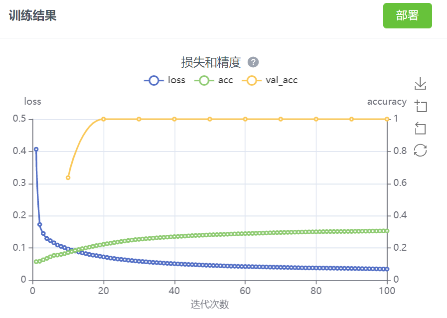
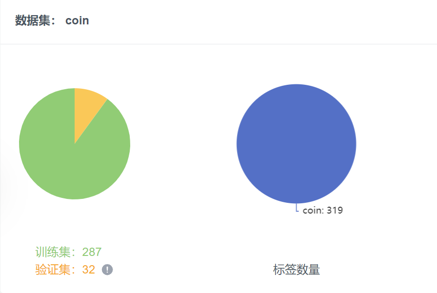

---
部署平台	nncase
训练次数	100
学习率	0.001
模型类型 迁移训练
模型网络 YOLO v2
主干网络 resnet18
---
# README

```python
input_size = (224, 224)
labels = ['coin']
anchors = [2.69, 1.87, 2.72, 1.72, 2.44, 1.56, 3.06, 2.13, 2.67, 2.0]
```



